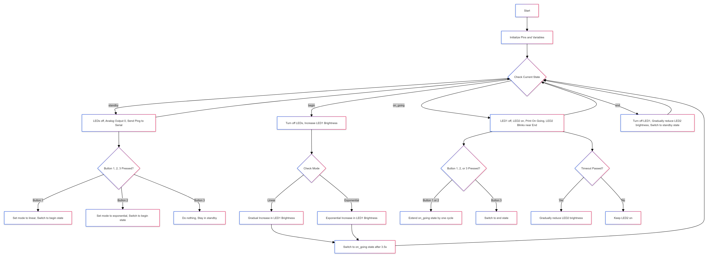

# ESP32 Control System with 3 Buttons and 2 LEDs

## Table of Contents
1. [Description](#description)
2. [Hardware Requirements](#hardware-requirements)
   - [Button Assignments](#button-assignments)
   - [LED Assignments](#led-assignments)
3. [Software Requirements](#software-requirements)
4. [Operating Modes and State Transitions](#operating-modes-and-state-transitions)
   - [Standby](#standby)
   - [Begin](#begin)
   - [On Going](#on-going)
   - [End](#end)
5. [Control Functionality](#control-functionality)
6. [Visual Feedback](#visual-feedback)
7. [Serial Monitoring](#serial-monitoring)
8. [Code Structure](#code-structure)
9. [Usage](#usage)
10. [Wokwi Example](#example)
11. [Flowchart](#flowchart)
12. [Troubleshooting](#troubleshooting)

## Description
This project aims to implement an ESP32-based control system using 3 buttons and 2 LEDs with various operating modes and state transitions. The system will produce an analog output with a range of 0 to 2048 (12-bit) and provide visual feedback through LEDs based on the system's status.

The control system is designed to simulate a simple device with different operating modes and state changes, allowing users to interact with it and observe the corresponding visual and analog output responses.

## Hardware Requirements
- ESP32 development board
- 3 push buttons
- 2 LEDs

### Button Assignments
1. Button 1 (Pin 5): Mode selection - Linear
2. Button 2 (Pin 18): Mode selection - Exponential
3. Button 3 (Pin 19): Direct End

### LED Assignments
1. LED 1 (Pin 23): Analog Value Indicator
2. LED 2 (Pin 22): On Going State Indicator

## Software Requirements
- MicroPython for ESP32

## Operating Modes and State Transitions
The system has 4 main states:

### Standby
- Initial and default state.
- Analog output: 0.
- LEDs: Both LEDs are off.
- Sends a ping (every 3 seconds) to the serial port to indicate that the system is running.

### Begin
- Transition state that lasts for 3.5 seconds.
- Mode (linear or exponential) is selected based on the button pressed.
- Analog output increases according to the "selected mode" until it reaches the maximum value within this duration.
- LEDs: LED 1 turns on following the analog value, LED 2 remains off.

### On Going
- Main state that lasts for 5 seconds.
- Analog output remains at the maximum position.
- LEDs: LED 2 turns on, LED 1 is off. LED 2 blinks as 1.5 seconds approaches the end.

### End
- Final state that lasts for 1.5 seconds.
- Analog output decreases exponentially.
- LEDs: LED 2 dims following the analog value, LED 1 off.

## Control Functionality
- If Button 1 is pressed, the system will use the linear increment method.
- If Button 2 is pressed, the system will use the exponential increment method.
- If Button 1 or 2 is held for less than the "Begin" time, the system will go back to the "Standby" state using the exponential method.
- If Button 1 or 2 is held for greater than or equal to the "Begin" time, the system will continue to the next state ("On Going").
- If the system is in the "On Going" state:
  - If Button 3 is pressed, the system will directly go to the "End" state using the exponential method.
  - If Button 3 is held, the system will directly end using the linear method.
  - If Button 1 or 2 is pressed/held during the Blink state, the "On Going" state is extended by one cycle.

## Visual Feedback
- LED 1 will glow up as the analog value.
- LED 2 will turn on when the system is in the "On Going" state, and LED 1 will be off.
- LED 2 will blink (250ms on/off) when it's 1.5 seconds near the end of the "On Going" state.
- In the "End" and "Standby" states, both LEDs will be off.

## Serial Monitoring
The system will send a "Ping" message to the serial port every 3 seconds while in the "Standby" state to indicate that the system is running.

## Code Structure
The code is organized as follows:

1. Import necessary modules from the `machine` library.
2. Define constants for button and LED pins.
3. Set up button and LED pins.
4. Define global variables to track the system's state, analog value, mode, and timing.
5. Implement interrupt functions for button presses.
6. Define utility functions for debouncing and non-blocking delays.
7. Implement the main loop that handles the various states and transitions.

## Usage
1. Connect the ESP32 board, 3 buttons, and 2 LEDs as per the hardware requirements.
2. Upload the MicroPython code to the ESP32 board.
3. Monitor the serial output to observe the system's "Ping" messages and any other relevant information.
4. Interact with the system using the 3 buttons to experience the different operating modes and state transitions.

## example

- wokwi example : [example](https://wokwi.com/projects/406964496543260673)

## flowchart

## Troubleshooting
If you encounter any issues or have questions, please feel free to reach out to the project maintainers. You can also check the project's issue tracker on the repository for any known problems or solutions.
